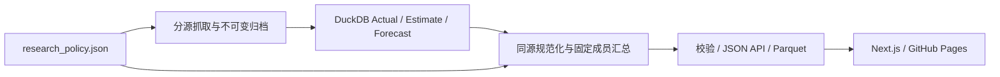

# 数据来源与历史/预测拼接方案

政策版本：`2026-09-08-regions-v1`。唯一配置：`config/research_policy.json`。

## 研究单元与主来源

| 研究单元 | 历史主/参考序列 | 当前预测 | 官方 Actual | 辅助对照 |
|---|---|---|---|---|
| Global | USDA PSD 全部来源国家的派生合计 | USDA PSD 同快照合计 | 尚无完整官方终值序列 | WASDE 官方 World 行 |
| 东南亚（按作物固定成员） | USDA PSD 同一成员集合历史估计 | USDA PSD 同一报告预测合计 | 不将 PSD Estimate 改称 Actual | 不做多机构均值 |
| 美国、巴西、阿根廷、印度、欧盟、俄罗斯、乌克兰、澳大利亚、加拿大及其他入选国家 | USDA PSD | USDA PSD | 有官方明确证据再单列接入 | WASDE / CropWatch 独立曲线 |
| 中国 | PSD MY 长历史仅作参考；NBS CY 实产独立展示 | CropWatch CY，长期用农业展望 CY | NBS，当前仅有 2025 三谷物实产 | 农业展望长期预测，不并入短期平均 |

**不使用邻国作为替代数据。** 每个成员用本国记录；地区求和只用本地区真实成员。同一个数据库覆盖多个国家，并不是拿一个国家数值代替另一个国家。

## 东南亚固定成员

| 作物 | 成员 | 汇总口径 |
|---|---|---|
| wheat | 不设汇总项：入选生产规模不足 | PSD MY；产量求和 |
| corn | Thailand, Vietnam, Indonesia, Philippines, Burma, Laos, Cambodia | PSD MY；产量求和 |
| rice | Thailand, Vietnam, Indonesia, Philippines, Burma, Laos, Cambodia, Malaysia | PSD MY；精米 |
| soybean | Indonesia, Burma | PSD MY；产量求和 |
| sugar | Thailand, Vietnam, Indonesia, Philippines, Burma | PSD MY；产量求和 |

## 小产量剔除规则

香港、澳门、新加坡、文莱、东帝汶不进入研究层，已下载原始记录仍归档。马来西亚只保留达到门槛的水稻，不保留零产量糖/玉米/大豆。
基于已归档 PSD 2020–2024 五个完整年份的平均产量，固定入选门槛：小麦/玉米/水稻 ≥0.5 Mt、大豆 ≥0.1 Mt、糖 ≥0.25 Mt。这是产品研究范围的判断标准，不是统计显著性标准。证据见 `docs/research_universe_evidence.json`。
成员名单随政策版本手工审查调整，不跟随每日数据自动改变。历史回看沿用当前固定研究范围，不能据此声称是当时已知的成分选择或无偏回测。

## 数据如何衔接

1. 海外历史：PSD 已修订历史 Estimate（通常1960起）；每次下载记录快照可得日期，不伪装成当年实时预测。
2. 海外预测：同一 PSD 数据库当前/前一市场年度仍标 Forecast，预测与历史独立字段/表/图例。后续快照逐版保留。WASDE历史月报曲线只作为平行来源，不能冒充PSD旧快照。
3. 中国：NBS Actual、CropWatch短期CY预测、农业展望长期CY预测各自保留。PSD中国MY历史与CY不能强拼；稻谷与精米、冬小麦与全年小麦、早稻/半晚稻与全年稻谷分别展示。
4. 地区：在同一document、目标年度、产品口径、状态和单位内，对固定成员求和。缺任一成员不发布该版本总量；保留旧版本但不冒充当前完整总量。
5. 地区同比 = 本年总产量 / 上年同成员总产量 − 1；等价于以上年产量为权重的成员增长，不平均各国同比。单产用总产量/总面积，稻谷单产不能由精米产量计算。
6. MY是各成员市场年度起始年对齐，并非所有国家同一自然年收获；地区进出口为成员毛额，包含内部贸易，不能视为地区对外贸易。
7. 跨机构均值默认关闭。只有同产品、同地区、同年度口径、同单位且45天内至少两家独立机构时，才可在对照区看共识；主序列不采用均值或自动补源。
8. 没有数据就保留N/A。禁止插值、借邻国产量、按比例分摊省级或拼接不兼容口径。

## 各作物入选国家

| 作物 | 国家（均用本国数据；海外主来源PSD） |
|---|---|
| wheat | China, United States, Brazil, Argentina, India, European Union, Russia, Ukraine, Australia, Canada, Mexico, South Africa, Kazakhstan, Paraguay, Bangladesh, Pakistan, Turkey, Japan, United Kingdom |
| corn | China, United States, Brazil, Argentina, India, European Union, Russia, Ukraine, Canada, Thailand, Vietnam, Mexico, South Africa, Kazakhstan, Paraguay, Indonesia, Bangladesh, Philippines, Pakistan, Turkey, Korea, North, Burma, Laos, Cambodia |
| rice | China, United States, Brazil, Argentina, India, European Union, Russia, Thailand, Vietnam, Paraguay, Indonesia, Bangladesh, Philippines, Pakistan, Turkey, Japan, Korea, South, Korea, North, Taiwan, Burma, Laos, Cambodia, Malaysia |
| soybean | China, United States, Brazil, Argentina, India, European Union, Russia, Ukraine, Canada, Mexico, South Africa, Kazakhstan, Paraguay, Indonesia, Bangladesh, Turkey, Japan, Korea, South, Korea, North, Burma |
| sugar | China, United States, Brazil, Argentina, India, European Union, Russia, Ukraine, Australia, Thailand, Vietnam, Mexico, South Africa, Indonesia, Philippines, Pakistan, Turkey, Japan, Burma, United Kingdom |

## 代码与自动更新

- `policy.py`：配置校验、研究名单、主来源及公开来源矩阵。
- `regions.py`：完整同快照地区求和、成员证据与缺失控制。
- `research.py`：原始记录→规范国家名→Global→地区→研究范围→输出；Global先算，绝不把地区再加进去。
- `outlook.py`：当前值选择与同比；`scheduler.py`：按配置挑选到期任务。
- `update_all.py --group scheduled`：唯一自动更新入口；`--dry-run` 显示本次会检查哪些源；`--group all` 强制全源；`--group build` 仅重建。
- GitHub Actions每日唤醒一次，实际检查频率由配置控制：NOAA/PSD每日、WASDE/CropWatch/World Bank/NBS每7天、农业展望每30天。失败仍保留原数据与错误状态，下次到期重试。
- Actions先恢复便携库，运行统一入口，检查 publication_complete 后提交数据并部署确切提交；校验/JSON/Parquet任一步失败不部署。源站单项失败但既有数据校验通过时允许发布Stale状态。
- 静态 `/api/policy.json` 与动态 `/api/policy` 是同一来源矩阵；`/api/outlook/rice?view=regions` 默认地区，`view=countries` 下钻国家。

修改配置后依次执行 `python scripts/write_policy_docs.py`、`python scripts/update_all.py --group build`、`npm run build`。
