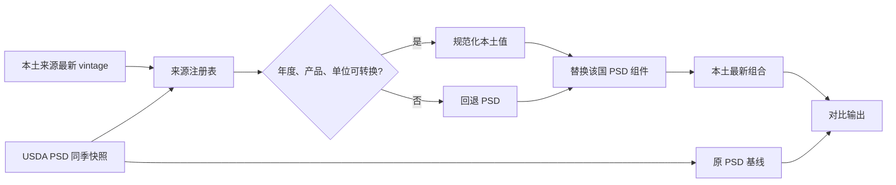

# 本土最新预测组合设计

日期：2026-09-09

## 目标

将首页的全球产量主线从纯 USDA PSD 汇总改为“本土最新预测优先”的组合汇总，同时保留原 PSD 基线用于对比和回退。首页仍然只展示简洁的全球地图、前五与其他；来源选择、替换明细、口径转换和覆盖率由后台生成。

组合不假设本土机构必然更准。它表达的是“截至当前可得日期，各主要生产国本土机构的最新判断”。准确率由后续 Forecast Vintage 回测独立评价。

## 方案选择

采用按国家、作物预先指定主来源的方案。发布时间只在同一主来源内部选择最新版本，不允许较新的不兼容来源自动覆盖较旧的兼容来源。

不采用以下两种方案：

- 全部来源取平均：不同机构的年度、产品和方法不同，平均值没有明确统计含义。
- 跨机构按发布日期直接取最新：例如 2026 年 8 月 CropWatch 中国玉米为 266.18 Mt，CASDE 为 306 Mt、PSD 为 307 Mt；直接采用较晚发布的 CropWatch 会让中国玉米减少 40.82 Mt，无法解释为正常预测修订。

## 中国双来源规则

| 作物 | 主来源 | 辅助来源 | 组合规则 |
|---|---|---|---|
| 玉米 | CASDE | CropWatch、PSD | 使用最新 CASDE；其他来源保留对照和偏离告警 |
| 大豆 | CASDE | CropWatch、PSD | 使用最新 CASDE；其他来源保留对照和偏离告警 |
| 食糖 | CASDE | PSD | 使用最新 CASDE |
| 小麦 | CropWatch | PSD | 使用最新、全国全年小麦口径的 CropWatch；冬小麦或省级表不得代替全国全年值 |
| 水稻 | CropWatch | NBS、PSD | CropWatch 为稻谷；只有取得可引用的中国稻谷转精米系数并登记版本后才进入精米全球组合 |

中国农业展望继续作为长期预测，不参与当前年度的最新组合。

如果 CASDE 或 CropWatch 超过各自新鲜度门槛，组合保留上次成功版本并标记 `stale`。如果主来源缺少目标作物或口径验证失败，则该国家、作物回退到同季 PSD，而不是改用另一个更晚但不兼容的来源。

## 国家和地区来源

| 国家/地区 | Forecast 主来源 | Actual 主来源 | PSD 作用 |
|---|---|---|---|
| 中国 | CASDE + CropWatch，按作物分工 | NBS | 对比与回退 |
| 美国 | NASS/WASDE | NASS | 同体系基线，无重复替换 |
| 加拿大 | AAFC | Statistics Canada | 对比与回退 |
| 巴西 | CONAB | CONAB 最终调查 | 对比与回退 |
| 阿根廷 | BCR | SAGyP | 对比与回退 |
| 欧盟 | EC Short-term Outlook | Eurostat | 对比与回退 |
| 澳大利亚 | ABARES | ABS/ABARES 最终值 | 对比与回退 |
| 印度 | DA&FW Advance Estimates | DA&FW Final Estimates | 对比与回退 |
| 黑海 | 乌克兰 UGA；俄罗斯先保留 SovEcon 对照 | 各国官方统计 | 未通过来源稳定性审查前仍使用 PSD |
| 南非 | CEC | CEC Final | 对比与回退 |
| 东南亚 | 有完整版本链的各国官方来源 | 各国统计部门 | Forecast 默认回退 |
| 其他国家 | 无 | 可用时接入详情 | 组合基线 |

俄罗斯来源目前主要通过二手报道取得，不能成为自动生产主来源。完成原始发布端点、发布日期和历史修订验证前，俄罗斯继续使用 PSD。

## 数据模型

新增以下配置和派生表：

1. `country_source_registry`
   - `country`, `crop`, `role`, `source`
   - `year_basis`, `commodity_basis`, `unit`
   - `publication_calendar`, `stale_after_days`
   - `conversion_id`, `priority`, `enabled`
2. `definition_crosswalk`
   - 原始年度与规范市场年度映射
   - Paddy/Milled、软麦/全小麦等产品转换
   - 转换公式、来源链接、有效期和审核状态
3. `canonical_production`
   - 保留原始值、规范值、来源文档、发布日期、可得日期和转换证据
4. `composite_vintage`
   - 每次更新生成不可变组合版本
   - 保存 PSD 基线、替换前值、替换后值、差额和组件记录
5. `forecast_evaluation`
   - 按固定预测时点保存 MAE、MAPE、偏差、方向准确率、修订波动和覆盖率

原始文档、解析版本和 Forecast Vintage 继续追加保存，不覆盖历史记录。

## 选择和汇总流程

计算公式：

`本土最新组合 = PSD 全球基线 - 已替换国家的 PSD 值 + 已规范化的本土值`

每个国家、作物只能出现一次。地区汇总只汇总成员，不再作为国家组件加入全球。中国水稻等未通过转换验证的项目回退 PSD，并在替换明细中写明原因。

## 当前方案与原方案的预估对比

以下为设计时点的静态测算，使用已核对的最新本土值；它不是上线后的正式组合结果。俄罗斯、水稻和其他未完成适配的项目继续使用 PSD。

| 作物 | 原 PSD 全球 Mt | 本土最新组合测算 Mt | 差额 Mt | 差额比例 | 主要变化来源 |
|---|---:|---:|---:|---:|---|
| 小麦 | 819.302 | 821.547 | +2.245 | +0.27% | 印度、澳大利亚上调；乌克兰、阿根廷下调；中国 CropWatch -0.040 Mt |
| 玉米 | 1298.878 | 1313.833 | +14.955 | +1.15% | 阿根廷 +11.000 Mt，巴西 +2.955 Mt，欧盟 +1.700 Mt，中国 CASDE -1.000 Mt |
| 大豆 | 442.253 | 440.077 | -2.176 | -0.49% | 阿根廷 -2.000 Mt、乌克兰 -0.400 Mt，南非和加拿大部分抵消 |
| 水稻 | 537.268 | 537.268 | 0.000 | 0.00% | 中国 CropWatch 为稻谷口径，验证转换前不替换 PSD 精米 |
| 食糖 | 184.854 | 185.084 | +0.230 | +0.12% | 中国 CASDE |

正式实现后，两种方案必须由同一次数据库构建生成，并保存逐国差额，不能沿用这张手工测算表。

## 页面展示

首页默认展示“本土最新组合”。在全球总量旁增加一个紧凑对比：

- 本土最新组合总量及同比
- 相对 PSD 基线的差额和百分比
- 已替换产量覆盖率
- 数据日期

地图、前五与其他统一使用本土最新组合的国家组件，确保排名与全球总量可加回。来源矩阵、回退原因、转换证据和逐国差额放在详情数据接口，不占用首页主要空间。

## 失败处理

- 单一来源抓取失败：保留最后成功 vintage；超过新鲜度门槛时标为 stale。
- 解析或单位校验失败：该国家、作物回退到同季 PSD，组合仍可发布。
- 年度映射、产品转换或成员互斥校验失败：不得发布该次组合。
- 本土组合与 PSD 的单一国家差异超过 10%：在来源、年度和产品校验通过后仍采用本土值，同时生成高偏离记录；校验不通过则回退 PSD。
- 所有回退与偏离均进入机器可读 JSON，页面只显示总体覆盖率和数据状态。

## 验证

- 组合组件互斥，前五加其他等于全球组合。
- 每项替换可追溯到原始文档、vintage、转换规则和被替换的 PSD 记录。
- 同一来源只选目标时点之前最新可得版本。
- 南半球作物季按作物映射，不能把日历 2026 机械对应所有 PSD 2026/27。
- 水稻、食糖、小麦分类不兼容时必须回退，不能静默换算。
- 生成原 PSD 与新组合的逐作物、逐国家差额，并对总差额复核。
- 完成现有 Python、数据完整性、TypeScript、Next build 和浏览器检查。

## 实施顺序

1. 建立来源注册表、定义转换表和组合计算器。
2. 接入中国 CASDE，并把已有 CropWatch 纳入中国双来源规则。
3. 接入结构化程度较高的 AAFC、CONAB、ABARES、印度 DA&FW、南非 CEC。
4. 接入 EC、BCR 和 UGA；俄罗斯继续 PSD，直到原始端点审查完成。
5. 生成新旧方案对比 API，更新首页默认数据主线。
6. 保存首个组合 vintage，完成验证后由 GitHub Actions 定时更新。
